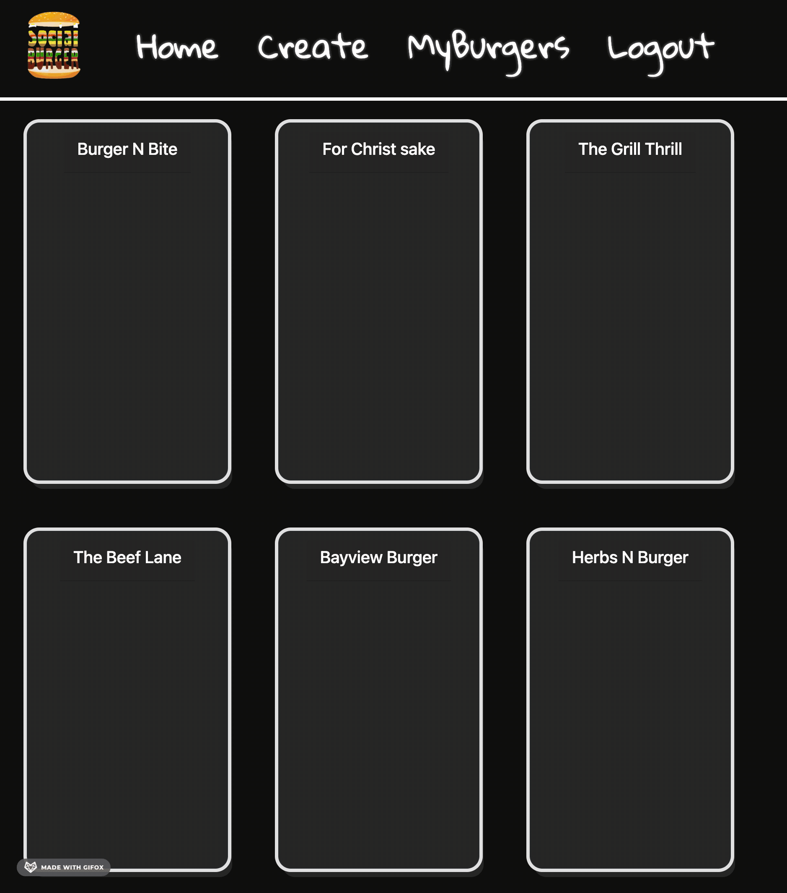
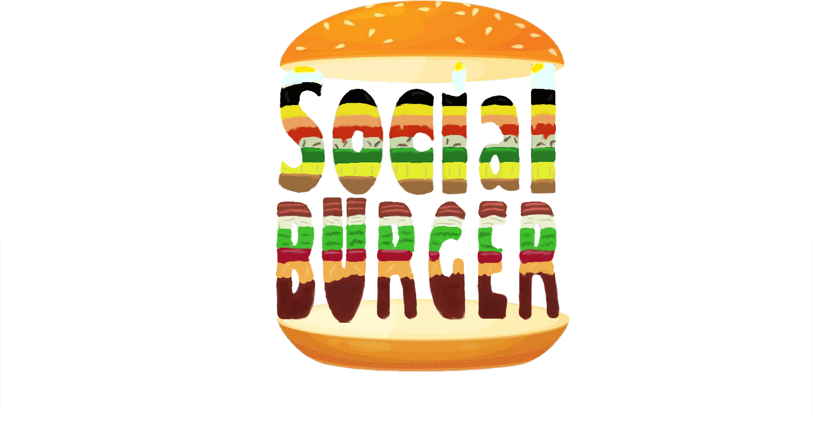

# Social Burger 🍔

## Table of Content 📕
- [Description](#Description)
- [Installation](#Install)
- [Usage](#Usage)
- [Colaborators](#Colaborators)
- [License](#License)  
  
# Description 📝
 Social Burger is a site in which users interact with each other  by sharing their own customized burger. On social burger, our main goal is to connect with people around the globe with creativity and innovation.
 
 In this app users are greeted by the home page with posted burgers. The user is promted to login before they are able to create their own burger or comment on a burger. If the user does not already have an account, they can register. After that the user my comment on burgers, like them, create their own, and viewe burgers that they have previously made if applicable. 
 
# Deployed App 🌐

https://social-burger.herokuapp.com/

# Samples 🍔

# Install 💾
Download or clone repository to use this application on local machine.
Node.js and MySQL are required to run the application

To install necessary dependencies, navigate to the root directory and run the following command:

npm i

# Technology 🎛
* HTML
* Handlebars
* CSS
* Bootstrap
* AOS
* JavaScript
* Express.js
* Node.js
* SQL
  
# Colaborators 🧑‍💻

  #### [Kevin Hernandez](https://github.com/kh288)
  #### [Walter Underwood](https://github.com/Wau00)
  #### [Caitlin Lindauer](https://github.com/CL2731)
  
  
# License 🪪

This project is protected under MIT license. 
